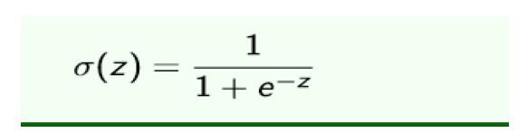
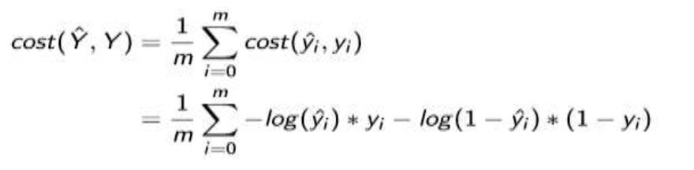
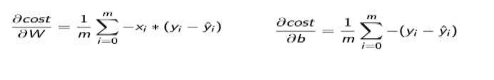
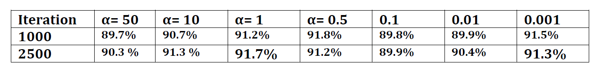
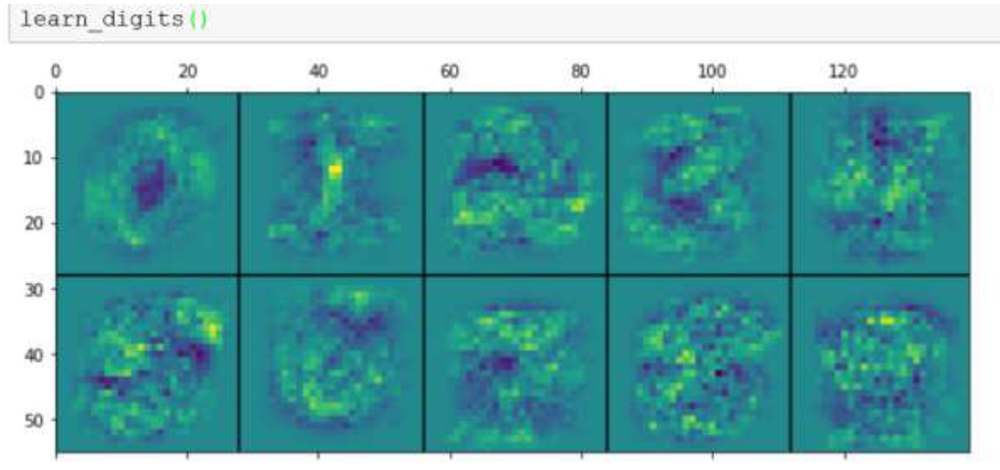

# Classification of handwritten digits
The central objective of this assignment is to demonstrate how Logistic Regression is
performed an implemented using python for classifying hand written digits.

### Problem decomposition

#### Step 1: The sigmoid function
 The sigmoid function for a logistic regression is given by:-

 Figure 1: Sigmoid Function 

#### Step 2: Feature normalization:
To normalize the features of an input data set X to have mean 0 and standard deviation 1.This
simplifies learning task our model by making the data to have the same scale.

we used the numpy package and mean and standard deviation (std) built in function in order
to scale the value of the different data sets to have mean 0 and standard deviation

#### Step 3: Cost function
The cost function for a binary logistic regression for a given dataset can be given as shown below

 Figure 2: Logistic regression cost function
 

 
#### Step 4: Calculating the gradients
In order to optimize the cost function we need to perform a derivation on the cost function
with respect to the slope (W) and the bias (b) and results the following formulas.

 

  Figure: Gradient descent
 

  
 
#### Step 5: Making predictions
Here we are predicting the positive examples of the data values (digits) when the value of the
sigmoid function is greater than 0.5 and negative example if the value is less than or equal to 0.5. If the value is greater than 0.5 it is
classified in the positive class or class 1 otherwise it goes to the negative class which is class 0.
#### Step 6:Evaluation of the solution (Measuring performance)

After we trained our model we need to test on the unseen data. So in this case to know the
percentage of the correctly classified/predicted values we need to perform summation of over the
whole unseen data as follows. This validation is performed based on the outcome of the classify
function and added all the positive examples (>0.5) on the test data (Y_test).

#### Step 7: Finding the best learning rate
the main task is to evaluate the performance of the model using different learning rate values
and number of iterations in the gradient_descent () function. To see the impact of changing
learning rate and number of iterations on the performance of the model and I registered
performance values as below.

  Figure : Performance model over Iteration table
  
 
   
  
#### Step 8: Learning to classify digits
To see the actual digit classification we need to run the learn_digits () function and found the following classification result

  Figure : Digit classification using logistic regression
  

   
  
  
From the displayed plot we can see that the dark pixels are located on the center of the image on
the some of the images especially on the top and bottom left of the plot, this means this dark pixel is
unlikely to represent the number and the classifier will have less confidence to put it into the
positive class.

  

